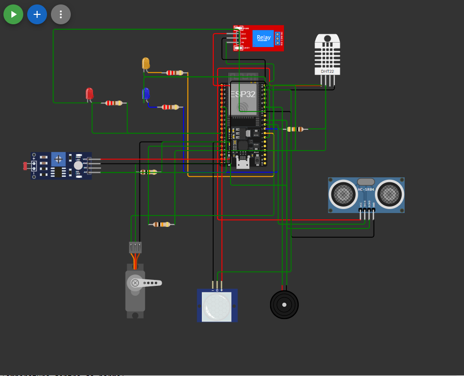
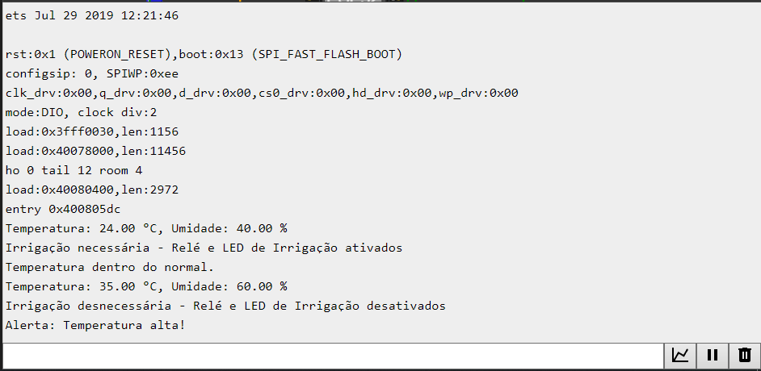
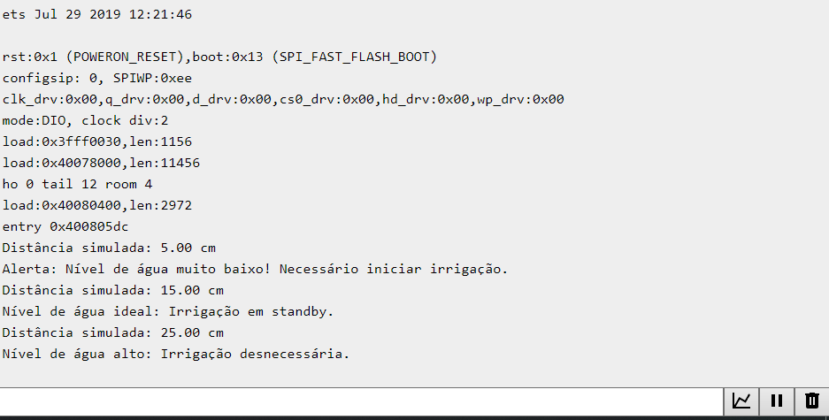
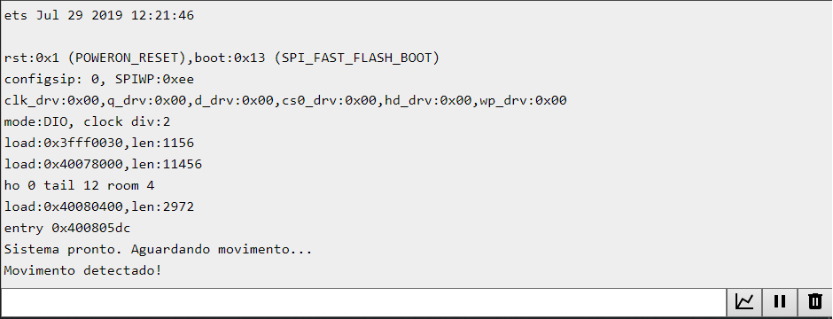
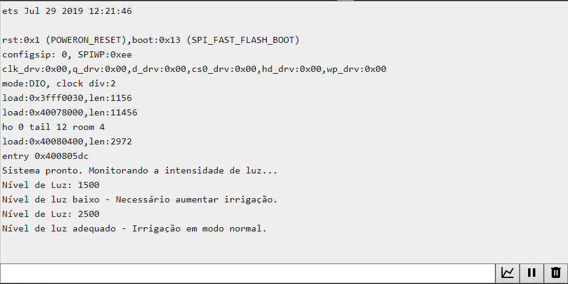
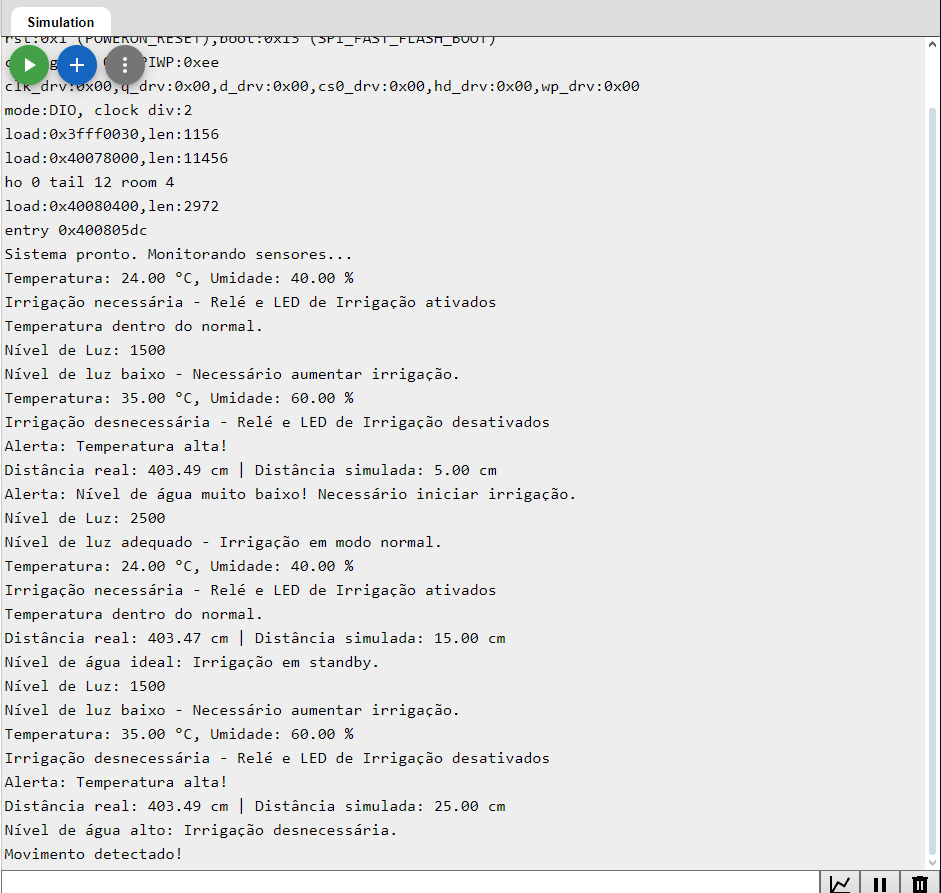

# FIAP - Faculdade de Informática e Administração Paulista

 

# Sistema Inteligente de Monitoramento Agrícola com ESP32

## Grupo 66

## 👨‍🎓 Integrantes: 
- Gustavo Valtrick - RM559575
- Iago Cotta - RM559655
- Pedro Scofield - RM560589
- Rodrigo Mastropietro - RM560081
- Tiago de Andrade Bastos - RM560467

## 👩‍🏫 Professores:
### Tutor(a) 
- <a href="https://www.linkedin.com/in/lucas-gomes-moreira-15a8452a/">Lucas Gomes Moreira</a>
### Coordenador(a)
- <a href="https://www.linkedin.com/in/profandregodoi/">André Godoi</a>

## 📜 Objetivo do Projeto

O objetivo deste projeto é desenvolver um sistema inteligente de monitoramento agrícola utilizando o microcontrolador ESP32 e sensores diversos para otimizar recursos na agricultura, como a irrigação e o controle climático. O sistema monitora variáveis ambientais (umidade, temperatura, nível de água e intensidade de luz) e detecta movimento para ativar um alerta. Além disso, a simulação de diferentes condições permite avaliar o funcionamento do sistema de forma prática e precisa.

## 📁 Estrutura de pastas

Dentre os arquivos e pastas presentes na raiz do projeto, definem-se:

- <b>.github</b>: Nesta pasta ficarão os arquivos de configuração específicos do GitHub que ajudam a gerenciar e automatizar processos no repositório.

- <b>assets</b>: aqui estão os arquivos relacionados a elementos não-estruturados deste repositório, como imagens.

- <b>config</b>: Não utilizada no projeto.

- <b>docs</b>: documentação do projeto, incluindo a descrição do sistema e explicações sobre cada sensor.

- <b>scripts</b>: Não utilizada no projeto.

- <b>src</b>: Contém o código-fonte do projeto.

- <b>README.md</b>: arquivo que serve como guia e explicação geral sobre o projeto (o mesmo que você está lendo agora).

## Desenho do Circuito Completo

## Descrição do papel de cada sensor no sistema
Este projeto é implementado no simulador [Wokwi](https://wokwi.com/), e o circuito completo envolve os seguintes componentes:
- **ESP32** - Microcontrolador central.
- **DHT-22** - Sensor de temperatura e umidade.
- **HC-SR04** - Sensor ultrassônico para monitoramento do nível de água.
- **PIR** - Sensor de movimento que aciona um alerta.
- **LDR** - Sensor de luz para medir a intensidade de luz solar.
- **Relé** - Para controle da bomba de irrigação.
- **Servo Motor** - Movimentado como parte do sistema de alerta.
- **Buzzer** - Emite alerta sonoro em caso de detecção de movimento.
- **LEDs** - Indicadores para o status de irrigação, alerta de baixo nível de água e umidade.

## Como configurar e rodar o projeto no Wokwi

### No Wokwi
1. Acesse [Wokwi.com](https://wokwi.com/) e crie um novo projeto.
2. Importe o código completo do projeto no editor.
3. Carregue o arquivo `diagram.json` para configurar o circuito.
4. Clique em “Iniciar Simulação” para executar o projeto e visualizar as leituras dos sensores e o funcionamento do sistema.

## 🧪 Testes Realizados
O sistema exibe as leituras de cada sensor e as ações correspondentes no Monitor Serial, incluindo:
- Mensagens de alerta sobre temperatura e umidade.
- Mensagens de nível de água e necessidade de irrigação.
- Ativação de alerta de movimento.
- Monitoramento de luz solar, com ativação de alertas para aumentar a irrigação.

### Prints do Monitor Serial com mensagens de funcionamento

- **DHT22**: Testado para alternar entre umidade alta e baixa e observar a ativação e desativação do relé e LEDs.

- **HC-SR04**: Testado para simular três níveis de água (baixo, ideal e alto), com a ativação dos LEDs de alerta e irrigação.

- **PIR**: Testado para simular movimento, verificando o funcionamento do buzzer e do servomotor.

- **LDR**: Testado para alternar entre luz alta e baixa, ajustando a necessidade de irrigação.

- **Integração de todos os sensores**: Testado para verificar o funcionamento na integração de todos os sensores no microcontrolador ESP32

### Resultados

A simulação mostrou que o sistema responde adequadamente a diferentes condições ambientais, acionando os componentes conforme esperado para otimizar o uso de recursos na agricultura.

## 📋 Licença

 

[MODELO GIT FIAP](https://github.com/agodoi/template) por [Fiap](https://fiap.com.br) está licenciado sob [Attribution 4.0 International](http://creativecommons.org/licenses/by/4.0/?ref=chooser-v1).
