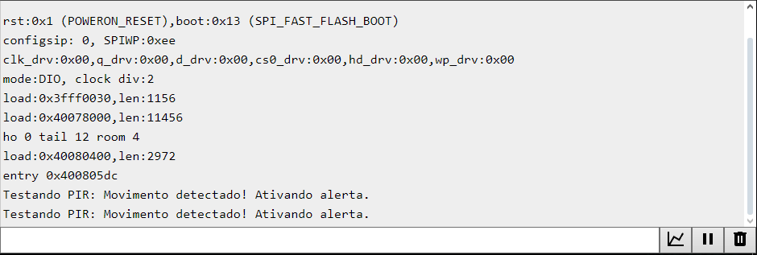

## Validação do PIR: Movimento
Este código testa a reação do sistema ao simular a detecção de movimento, acionando o buzzer e o servomotor.
```
#include <ESP32Servo.h>

#define PIR_PIN 23
#define BUZZER_PIN 22
#define SERVO_PIN 21

Servo meuServo;

void setup() {
    Serial.begin(115200);
    pinMode(PIR_PIN, INPUT);
    pinMode(BUZZER_PIN, OUTPUT);
    meuServo.attach(SERVO_PIN);
    meuServo.write(0);
}

void loop() {
    bool movimentoDetectado = true; // Simula a detecção de movimento

    if (movimentoDetectado) {
        Serial.println("Testando PIR: Movimento detectado! Ativando alerta.");
        tone(BUZZER_PIN, 1000); delay(500); noTone(BUZZER_PIN);
        meuServo.write(90); delay(1000);
        meuServo.write(0);
    }
    delay(5000);
}
```
## A partir da imagem, verificamos o funcionamento pelo Monitor Serial:

